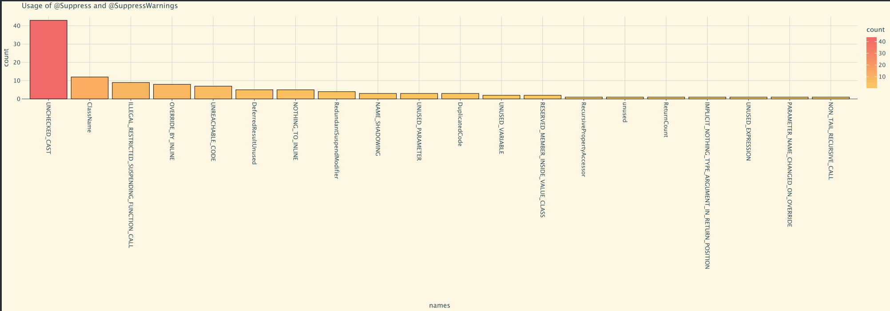

# Suppressenator

This repository contains a [Kotlin notebook](https://blog.jetbrains.com/kotlin/2023/07/introducing-kotlin-notebook/) 
file which you can use to find all the @Suppress and @SuppressWarning annotations in your code.   

### Why?
Because if you're using a static code analyzer like [Detekt](https://github.com/detekt/detekt), you might realize that 
you tend to find some of the rules cumbersome and ignore them often by adding @Suppress annotations in your code. 
This might be an indicator that some of the rules are wrong for your project and need to be adjusted. This tool allows 
you to find which @Suppress annotations are mostly used, and thus point to the rules that need adjustment.

### How?
1. Install the [Kotlin notebook](https://plugins.jetbrains.com/plugin/16340-kotlin-notebook) plugin in you Intellij
2. Copy the **suppressenator.ipynb** file from this repository and put it in your own repository
3. Adjust the `rootDirectory` to match the root of your code
4. Press the `Run All` button on the top of the notebook 
5. Voila! The notebook will attempt to find all your @Suppress and @SuppressWarning annotations and visualise them at
the bottom.

Using the Suppressenator with the example repository gives the following image: 

As you can see, we suppress way too many `UnusedPrivateMember`s.

### But @Suppress annotations are bad! Nobody should use them!
Oh, really? How about [Kotlin](https://github.com/JetBrains/kotlin)?

Or [Arrow](https://github.com/arrow-kt/arrow)?

Or [Detekt](https://github.com/detekt/detekt)?

